  

  <a href="https://github.com/only1stumpy">GitHub</a>
  ·
  <a href="https://t.me/only1stumpy">Телеграм</a>
  ·
  <a href="https://t.me/only1stumpyy">Телеграм-канал</a>

---

## Обо мне

Разрабатываю full-stack приложения на **Next.js**, **React**, **TypeScript**, **PostgreSQL** и **Prisma** — от UI и клиентской логики до серверной части, авторизации, админ-панелей и деплоя.

В проектах уделяю внимание удобству интерфейса, чистой структуре кода, производительности и реальным пользовательским сценариям.

---

## Технологии

  
  
  
  
  

  
  
  
  

  
  
  

---

## Ключевые проекты

###  GDQuiz

Интерактивный квиз для фанатов Geometry Dash: пользователь ранжирует уровни по сложности и сравнивает свой результат с официальным Demon List.

- 1 700+ уровней
- 5 режимов игры
- Drag & Drop интерфейс
- YouTube-интеграция
- Seed-ссылки для шаринга
- Русский и английский языки
- **15 000+ уникальных пользователей**

**Стек:** Next.js, TypeScript, PostgreSQL, Prisma, Zustand, Zod, Tailwind CSS

🔗 [gdquiz.com](https://gdquiz.com) · 📦 [Репозиторий](https://github.com/only1stumpy/GD-Quiz)

---

###  MeloDown 

Self-hosted сервис для скачивания музыки в WAV на основе Spotify metadata.

Пользователь вставляет ссылку на Spotify-трек, выбирает оригинал или instrumental-версию и получает WAV-файл с корректным названием, обложкой и метаданными.

- Spotify Web API
- Поиск аудио через `yt-dlp`
- Конвертация через `ffmpeg`
- WAV export
- История последних загрузок
- Локальная / VPS-first архитектура

**Стек:** Next.js, TypeScript, Spotify Web API, yt-dlp, FFmpeg, sharp, Zod

🔗 [Live Demo](http://92.5.22.227:3000/) · 📦 [Репозиторий](https://github.com/only1stumpy/MeloDown)

---

### `TechnoStore`

Дипломная работа full-stack интернет-магазина электроники с клиентской частью, личным кабинетом и административной панелью.

- Каталог, поиск и фильтрация
- Корзина и оформление заказа
- Авторизация по SMS-коду
- Избранное и сравнение товаров
- Отзывы и рейтинги
- Промокоды
- Админ-панель
- Транзакционное создание заказов
- Защита от дублей через `Idempotency-Key`

**Стек:** Next.js, TypeScript, PostgreSQL, Prisma, Redis, Zod, Zustand, Tailwind CSS

🔗 [technostore-drab.vercel.app](https://technostore-drab.vercel.app/) · 📦 [Репозиторий](https://github.com/only1stumpy/TechnoStore)

---

## GitHub статистика

  
  

---

## Контакты

  
  

